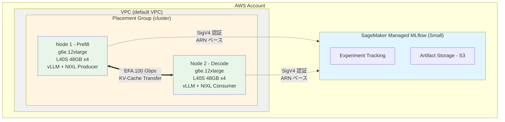

# NIXL と AWS EFA で実現する Disaggregated Inference: 環境構築編

## はじめに

Large Language Model (LLM) の推論は、(1) 入力プロンプトを処理する **Prefill フェーズ**と (2) トークンを逐次生成する **Decode フェーズ**に分かれます。

### Disaggregated Inference の設計動機

従来のモノリシックな推論パイプラインでは、Prefill と Decode を同じ GPU 上で実行します。しかし、これら 2 つのフェーズは性質が大きく異なります：

- **Prefill フェーズ**: コンピュート律速（GPU 演算性能が重要）。GPU 利用率が高く、並列処理により高速化が可能
- **Decode フェーズ**: メモリ帯域律速（KV-Cache へのアクセスが支配的）。GPU 利用率が低く、逐次生成のためスループットが制限される

単一ノードで両フェーズを実行すると、Decode 中の GPU 利用率低下により、高価な GPU リソースが遊休状態になります。**Disaggregated Inference** は、この 2 つのフェーズを異なる GPU ノードに分離することで、各フェーズに最適なリソース配分を実現します。

**トレードオフ**: 分離のメリット（リソース効率向上）と引き換えに、**KV-Cache のネットワーク転送レイテンシ**というコストが発生します。このコストを最小化するため、AWS EFA の低レイテンシ通信（100 Gbps、カーネルバイパス）が重要になります。

本記事では、この Disaggregated Inference の実験基盤として、AWS Elastic Fabric Adapter (EFA) を活用した GPU クラスタ環境を AWS CDK で構築します。あわせて、実験管理に SageMaker Managed MLflow を統合し、パラメータとメトリクスを体系的に記録できる環境を整えます。

### 本記事で構築する環境

- **GPU クラスタ**: g6e.12xlarge (NVIDIA L40S 48GB x4) の 2 ノード構成
- **高速ネットワーク**: EFA による 100 Gbps の低レイテンシ通信
- **SageMaker Managed MLflow**: 実験パラメータとメトリクスの一元管理
- **検証ツール**: 環境の正常性を確認するスクリプト群

### 実験対象

- **モデル**: Qwen2.5-32B-Instruct
- **トークン長**: 4K-100K tokens
- **TP サイズ**: 4（全 4 GPU を使用）
- **KV-Cache 転送**: NIXL (NixlConnector) による EFA / TCP 比較

### 対象読者

- AWS でディープラーニング実験環境を構築する方
- EFA による高速ノード間通信を試したい方
- MLflow で実験を体系的に管理したい方

### 前提知識

- AWS の基礎知識 (EC2, VPC, IAM, CloudFormation)
- AWS CDK の基本操作
- Python と bash の基本的な読み書き

## アーキテクチャ

構築する環境の全体像:



### インスタンス仕様

| 項目 | g6e.12xlarge |
|------|-------------|
| GPU | NVIDIA L40S x4 |
| GPU メモリ | 48 GB/GPU (合計 192 GB、実効約 46 GB/GPU) |
| vCPU | 48 |
| システムメモリ（RAM） | 384 GB |
| EFA 帯域幅 | 100 Gbps |
| ネットワーク帯域幅 | 40 Gbps |
| EBS 帯域幅 | 40 Gbps |

:::message
g6e.12xlarge は NVIDIA L40S を搭載しています。Qwen2.5-32B-Instruct を TP=4 で配置した場合、100K tokens の KV-Cache を保持しても各 GPU に約 16 GB の余裕があります。これは g5.12xlarge (A10G 24GB x4) と比較して、GPU あたり約 24 GB 多いメモリを確保でき、長コンテキストの推論に適しています。
:::

### 主要コンポーネントと選定理由

**SageMaker Managed MLflow**

マネージド型の MLflow tracking server。Small/Medium/Large の 3 つのサイズから選択でき、サーバー運用が不要です。S3 にアーティファクトを永続化し、IAM ベースのアクセス制御により、チーム間でも安全に実験データを共有できます。本記事では Small サイズ（最大 25 ユーザー、TPS 25）を使用します。

**EFA (Elastic Fabric Adapter)**

AWS が提供する高性能ネットワークインターフェース。OS のカーネルバイパス（OS-bypass）により、通常の TCP/IP 通信と比べてレイテンシを大幅に削減します。libfabric プロバイダーを通じて RDMA（Remote Direct Memory Access）通信を実現し、CPU オーバーヘッドを最小化します。

g6e.12xlarge では **100 Gbps** の EFA 帯域幅が利用可能です。Disaggregated Inference では KV-Cache の転送がボトルネックとなるため、EFA による低レイテンシ通信が重要です。

:::message
**GPUDirect RDMA について**: GPU メモリから直接ネットワークへデータを転送する GPUDirect RDMA は、p4d/p5 系インスタンス（A100/H100 + NVSwitch）で利用可能な機能です。g6e インスタンス（L40S）では、EFA のカーネルバイパスによる低レイテンシ通信を利用します。
:::

:::message alert
g6e.12xlarge の EFA 帯域幅は **100 Gbps** です。400 Gbps は g6e.48xlarge 以上のインスタンスタイプで利用可能な帯域幅であり、g6e.12xlarge では該当しません。AWS ドキュメントで正確な値を確認してください。
:::

**Placement Group (cluster 戦略)**

同一 Availability Zone 内の物理的に近接したラックにインスタンスを配置することで、ネットワークのホップ数を最小化し、EFA の性能を引き出します。

**SSM Session Manager**

SSH keypair やポート 22 の開放が不要で、IAM ベースで安全にインスタンスへアクセスできます。CloudTrail でアクセスログが記録されるため、監査要件を満たします。

## 前提条件

### ローカル環境

以下がインストールされていること:

```bash
# バージョン確認
node --version      # v18 以上
aws --version       # AWS CLI v2
cdk --version       # AWS CDK v2
python3 --version   # Python 3.9 以上
```

### AWS 環境

- AWS CLI の認証設定 (`aws sts get-caller-identity` で確認)
- 適切な IAM 権限 (EC2, VPC, SageMaker, CloudFormation)
- EC2 容量制限の確認（後述）

### Session Manager Plugin のインストール

インスタンスへのアクセスに使用します。

#### macOS

```bash
brew install --cask session-manager-plugin
session-manager-plugin --version
```

#### Ubuntu/Debian

```bash
curl "https://s3.amazonaws.com/session-manager-downloads/plugin/latest/ubuntu_64bit/session-manager-plugin.deb" -o "session-manager-plugin.deb"
sudo dpkg -i session-manager-plugin.deb
session-manager-plugin --version
```

#### Amazon Linux/RHEL/CentOS

```bash
curl "https://s3.amazonaws.com/session-manager-downloads/plugin/latest/linux_64bit/session-manager-plugin.rpm" -o "session-manager-plugin.rpm"
sudo yum install -y session-manager-plugin.rpm
```

## 実装手順

### 1. リポジトリのクローン

```bash
git clone https://github.com/littlemex/disaggregated-inference-with-nixl-over-aws-efa.git
cd disaggregated-inference-with-nixl-over-aws-efa
```

### 2. AWS 認証情報の確認

```bash
aws sts get-caller-identity
```

アカウント ID とユーザー/ロール情報が表示されることを確認してください。

### 3. リージョンと環境変数の設定

```bash
export AWS_DEFAULT_REGION=us-east-1
export CDK_DEFAULT_REGION=us-east-1
export CDK_DEFAULT_ACCOUNT=$(aws sts get-caller-identity --query Account --output text)
```

:::message
このプロジェクトでは `us-east-1` リージョンを使用します。他のリージョンを使用する場合は、上記の環境変数と後続のデプロイコマンドを変更してください。これらの環境変数は現在のシェルセッションでのみ有効です。永続化する場合は `~/.bashrc` や `~/.zshrc` に追記します。
:::

### 4. EC2 容量制限の確認

g6e.12xlarge は 1 インスタンスあたり 48 vCPU を使用します。本構成では 2 ノードのため、最低 **96 vCPU** が必要です。

```bash
# Running On-Demand G and VT instances の vCPU 上限を確認
aws service-quotas get-service-quota \
  --service-code ec2 \
  --quota-code L-DB2E81BA \
  --region us-east-1 \
  --query 'Quota.Value' \
  --output text
```

表示された値が `96` 未満の場合は、AWS Service Quotas コンソールから引き上げリクエストを送信してください。引き上げには数時間から数日かかる場合があります。

::::details g6e インスタンスの容量に関する補足

g6e シリーズは比較的新しいインスタンスタイプのため、アカウントのデフォルト上限が低い場合があります。Service Quotas の "Running On-Demand G and VT instances" が対象のクォータコードです。

リクエスト時に理由として「ML 推論実験のための GPU クラスタ構築」と記載すると承認されやすいです。

::::

### 5. CDK プロジェクトのセットアップ

```bash
cd cdk
npm install
```

### 6. CDK のブートストラップ

初回のみ実行:

```bash
npx cdk bootstrap
```

成功すると `CDKToolkit` スタックが作成されます。

### 7. スタックのデプロイ

g6e.12xlarge を使用してデプロイします:

```bash
npx cdk deploy --all \
  --context instanceType=g6e.12xlarge \
  --context availabilityZone=us-east-1c \
  --context trackingServerName=nixl-efa-mlflow
```

::::details CDK コンテキストパラメータの詳細

| パラメータ | デフォルト値 | 説明 |
|-----------|------------|------|
| `projectPrefix` | なし | スタック名の接頭辞（複数環境での衝突回避用） |
| `instanceType` | g5.12xlarge | EC2 インスタンスタイプ（EFA 対応が必須） |
| `availabilityZone` | VPC の最初の AZ | インスタンスを配置する AZ |
| `trackingServerName` | mlflow-tracking-server | MLflow tracking server の名前 |
| `volumeSize` | 200 (g6e.12xlarge の推奨値) | EBS ボリュームサイズ (GB) |
| `vllmPort` | 8100 | vLLM HTTP ポート |
| `vpcId` | default VPC | 使用する VPC の ID |
| `keyName` | なし | SSH キーペア名（SSM 推奨のため通常不要） |
| `useCapacityBlock` | false | ML Capacity Block を使用するか |
| `capacityReservationId` | なし | Capacity Reservation ID |

CDK 実装では、インスタンスタイプに応じて推奨 EBS ボリュームサイズが自動選択されます。g6e.12xlarge の場合は 200 GB がデフォルトです。

::::

:::message
**スタック依存関係について**

`cdk deploy --all` では、以下の順序でデプロイされます：

1. **MLflow スタック** (`mlflow-prod-east-1`) が先にデプロイ
2. MLflow tracking server ARN が CloudFormation の出力として保存
3. **NIXL EFA スタック** (`nixl-efa-dev-east-1`) がデプロイ時に自動的に ARN を参照

この順序は `bin/app.ts` の以下のコードで保証されています：

```typescript
const mlflowArn = mlflowStack.trackingServer.attrTrackingServerArn;
nixlEfaStack.addDependency(mlflowStack);
```

手動で ARN を指定する必要はありません。
:::

デプロイには 10-15 分かかります（MLflow tracking server の作成に大部分の時間を要します）。完了すると以下の出力が表示されます:

```
Outputs:
mlflow-prod-east-1.TrackingServerArn = arn:aws:sagemaker:us-east-1:123456789012: mlflow-tracking-server/nixl-efa-mlflow
nixl-efa-dev-east-1.Node1InstanceId = i-0123456789abcdef0
nixl-efa-dev-east-1.Node1PublicIp = 3.80.45.55
nixl-efa-dev-east-1.Node1PrivateIp = 172.31.27.100
nixl-efa-dev-east-1.Node2InstanceId = i-0abcdef0123456789
nixl-efa-dev-east-1.Node2PublicIp = 18.232.147.93
nixl-efa-dev-east-1.Node2PrivateIp = 172.31.27.101
nixl-efa-dev-east-1.ScriptsBucketName = nixl-efa-dev-east-1-scriptsbucket-xxxxx
nixl-efa-dev-east-1.SecurityGroupId = sg-0123456789abcdef0
nixl-efa-dev-east-1.PlacementGroupName = NixlClusterPlacementGroup-xxxxx
```

:::message
`TrackingServerArn` の値は後で使用するため、控えておいてください。IP アドレスはお使いの VPC 設定により異なります。
:::

### 8. デプロイ情報の取得

デプロイ完了後、インスタンス ID と IP アドレスを取得します。

```bash
# Node1 のインスタンス ID を取得
NODE1_ID=$(aws ec2 describe-instances \
  --region us-east-1 \
  --filters "Name=tag: Name,Values=nixl-node1" "Name=instance-state-name,Values=running" \
  --query 'Reservations[0].Instances[0].InstanceId' \
  --output text)

# Node2 のインスタンス ID を取得
NODE2_ID=$(aws ec2 describe-instances \
  --region us-east-1 \
  --filters "Name=tag: Name,Values=nixl-node2" "Name=instance-state-name,Values=running" \
  --query 'Reservations[0].Instances[0].InstanceId' \
  --output text)

# Node2 のプライベート IP を取得
NODE2_PRIVATE_IP=$(aws ec2 describe-instances \
  --region us-east-1 \
  --filters "Name=tag: Name,Values=nixl-node2" "Name=instance-state-name,Values=running" \
  --query 'Reservations[0].Instances[0].PrivateIpAddress' \
  --output text)

# 情報を表示
echo "Node1 Instance ID: $NODE1_ID"
echo "Node2 Instance ID: $NODE2_ID"
echo "Node2 Private IP: $NODE2_PRIVATE_IP"
```

### 9. インスタンスへの接続

SSM Session Manager でインスタンスに接続します。

```bash
# Node 1 に接続
aws ssm start-session --target $NODE1_ID
```

接続が成功すると、以下のプロンプトが表示されます:

```
Starting session with SessionId: user-0123456789abcdef0
sh-5.1$
```

bash に切り替えます:

```bash
bash
```

セッションを終了するには `exit` を 2 回入力します（1 回目で bash を終了、2 回目で SSM セッションを終了）。

### 9b. 環境変数の設定

CDK デプロイ時に User Data で `/etc/environment` に `MLFLOW_TRACKING_ARN` と `AWS_DEFAULT_REGION` が書き込まれます。SSM Session Manager 経由ではログインシェルのプロファイルが実行されないため、環境変数を手動で読み込む必要があります。

```bash
# インスタンス上で実行
source /etc/environment
echo $MLFLOW_TRACKING_ARN  # ARN が表示されることを確認
echo $AWS_DEFAULT_REGION    # us-east-1 が表示されることを確認
```

毎回 `source` するのが手間な場合は、`.bashrc` に追記しておくと便利です:

```bash
echo 'source /etc/environment' >> ~/.bashrc
```

### 10. GPU 環境の確認

g6e.12xlarge の GPU が正しく認識されていることを確認します。

```bash
# GPU の確認
nvidia-smi
```

以下のように NVIDIA L40S が 4 基表示されることを確認してください:

```
+-----------------------------------------------------------------------------------------+
| NVIDIA-SMI 550.xx.xx    Driver Version: 550.xx.xx    CUDA Version: 12.x                |
|-----------------------------------------------------------------------------------------+
| GPU  Name                 Persistence-M | Bus-Id          Disp.A | Volatile Uncorr. ECC |
|   0  NVIDIA L40S                    On  | 00000000: XX:00.0   Off |                    0 |
|   1  NVIDIA L40S                    On  | 00000000: XX:00.0   Off |                    0 |
|   2  NVIDIA L40S                    On  | 00000000: XX:00.0   Off |                    0 |
|   3  NVIDIA L40S                    On  | 00000000: XX:00.0   Off |                    0 |
+-----------------------------------------------------------------------------------------+
```

::::details GPU メモリ配分の計算

Qwen2.5-32B-Instruct を TP=4 で配置した場合のメモリ配分:

**KV-Cache サイズの計算**:

Qwen2.5-32B-Instruct のアーキテクチャ:
- `num_layers`: 64
- `num_kv_heads`: 8（GQA: Grouped Query Attention）
- `head_dim`: 128
- `precision`: fp16（2 bytes）

理論的な KV-Cache サイズ（100K tokens、TP=4）:
```
2 (K+V) × 64 layers × 8 kv_heads × 128 head_dim × 2 bytes × 100K tokens / TP=4
= 2 × 64 × 8 × 128 × 2 × 100,000 / 4
≈ 6.5 GB/GPU（理論値）
```

vLLM の実装では、KV-Cache のメモリ管理にページング、断片化防止、バッファリングなどの追加オーバーヘッドが発生します。実際の運用では理論値の約 3-4 倍のメモリを確保する必要があります。

| 項目 | 値 |
|------|-----|
| L40S GPU メモリ（公称値） | 48 GB/GPU |
| L40S GPU メモリ（実効値） | 約 46 GB/GPU |
| モデルウェイト (32B / TP=4) | 約 8 GB/GPU |
| KV-Cache (100K tokens、vLLM 実装) | 約 20-24 GB/GPU |
| vLLM オーバーヘッド | 約 2 GB/GPU |
| **残りメモリ** | **約 12-16 GB/GPU** |

`--gpu-memory-utilization 0.9` で起動すると約 41 GB/GPU が利用可能となり、100K tokens でも十分な余裕があります。

比較として、g5.12xlarge (A10G 24GB) の場合:

| 項目 | 値 |
|------|-----|
| A10G GPU メモリ | 24 GB/GPU |
| モデルウェイト (32B / TP=4) | 約 8 GB/GPU |
| KV-Cache (100K tokens、vLLM 実装) | 約 20-24 GB/GPU |
| vLLM オーバーヘッド | 約 2 GB/GPU |
| **必要メモリ合計** | **約 30-34 GB/GPU** |
| **不足メモリ** | **約 6-10 GB/GPU (OOM)** |

g5.12xlarge では 100K tokens の処理は OOM となるため、より大きな GPU メモリを持つ g6e.12xlarge の選択が必要です。

::::

### 11. 環境確認スクリプトの実行

インスタンス上でリポジトリをクローンし、検証スクリプトを実行します。

```bash
# インスタンス上で実行
cd /tmp
git clone https://github.com/littlemex/disaggregated-inference-with-nixl-over-aws-efa.git
cd disaggregated-inference-with-nixl-over-aws-efa/scripts

# 実行権限を付与
chmod +x check-environment.sh

# Node 2 のプライベート IP を環境変数に設定
export NODE2_PRIVATE_IP=172.31.27.101  # デプロイ出力の値に置き換える

# 実行
./check-environment.sh
```

`check-environment.sh` は以下の 7 項目を順番に検証します:

1. **EFA デバイス**: `/dev/infiniband/uverbs0` の存在、EFA インターフェース、`fi_info` コマンド
2. **GPU**: `nvidia-smi` の動作、GPU デバイス数、CUDA バージョン
3. **vLLM**: Python パッケージのインポート、CLI コマンド
4. **NIXL**: Python パッケージのインポート
5. **NCCL tests**: `/opt/nccl-tests/build/` 配下のベンチマークツール
6. **MLflow**: パッケージ、ARN 環境変数、接続テスト
7. **ネットワーク**: プライベート IP、インターネット接続、ピアノード接続

初回実行では、vLLM と NIXL がまだインストールされていないため、一部チェックが FAIL します。EFA、GPU、ネットワークのチェックがすべて PASS していれば、環境構築は正常です:

```
==========================================
Summary
==========================================
Checks passed: 10
Checks failed: 3

Some checks failed. Please review the output above.
```

vLLM と NIXL のインストールは次回の記事で扱います。

### 11b. Node 2 の環境検証

Node 2 でも同様に環境を確認します。

```bash
# ローカルから Node 2 に接続
aws ssm start-session --target $NODE2_ID
```

```bash
# Node 2 のインスタンス上で実行
bash
source /etc/environment

cd /tmp
git clone https://github.com/littlemex/disaggregated-inference-with-nixl-over-aws-efa.git
cd disaggregated-inference-with-nixl-over-aws-efa/scripts
```

:::message alert
**重要**: 次の環境変数 `NODE2_PRIVATE_IP` は、変数名に反して **Node 1 のプライベート IP アドレス** を設定します。この変数はスクリプト内で「ピアノードの IP」を意味し、Node 2 から実行する場合、ピアは Node 1 になります。
:::

```bash
# Node 1 のプライベート IP を設定（Node 2 から Node 1 への接続を確認）
export NODE2_PRIVATE_IP=172.31.27.100  # Node 1 のプライベート IP を設定

chmod +x check-environment.sh
./check-environment.sh
```

:::message
環境変数名 `NODE2_PRIVATE_IP` は、スクリプト内でピア (peer) ノードの IP を指定するために使用されます。Node 2 から実行する場合、ピアは Node 1 となるため、Node 1 のプライベート IP を設定してください。
:::

### 12. NCCL 通信ベンチマーク（ノード内 GPU 間通信）

単一ノード内の GPU 間通信性能を確認するため、NCCL 通信ベンチマークを実行します。

:::message
**スコープ**: このベンチマークは**単一ノード内の GPU 間通信**（NVLink/PCIe 経由）を測定します。ノード間の EFA 通信性能測定は、次回の記事で`mpirun`を使用した 2 ノード間 NCCL テストとして扱います。
:::

#### 12.1. NCCL tests のセットアップ

Node 1 で NCCL tests をインストールします。

```bash
# インスタンス上で実行
cd /tmp/disaggregated-inference-with-nixl-over-aws-efa/scripts

# NCCL tests のセットアップ（初回のみ）
sudo bash setup-nccl-tests.sh
```

このスクリプトは以下の手順で実行されます:

1. 依存パッケージ（build-essential, libopenmpi-dev など）のインストール
2. NCCL コアライブラリ（libnccl2, libnccl-dev）のインストール
3. NVIDIA 公式リポジトリから NCCL tests のクローン
4. MPI サポートを有効にしてビルド
5. `/opt/nccl-tests/build/` 配下にベンチマークツールを生成

#### 12.2. ベンチマークの実行

```bash
# Node 1 で実行
bash nccl-benchmark.sh
```

デフォルトでは、**all_reduce**（すべての GPU でデータを集約し、結果を全 GPU に配布する操作）と **all_gather**（すべての GPU からデータを収集し、全 GPU に配布する操作）の 2 つの NCCL collective operation を測定します。

測定パラメータ（カスタマイズ可能）:

```bash
# GPU 数を指定
NUM_GPUS=2 bash nccl-benchmark.sh

# データサイズ範囲を指定
MIN_SIZE=1M MAX_SIZE=64M bash nccl-benchmark.sh

# ステップファクターを指定
STEP_FACTOR=4 bash nccl-benchmark.sh
```

#### 12.3. EFA モードでの実行

EFA デバイスが検出されない場合は TCP モードで実行されます。EFA を有効化するには:

```bash
export FI_PROVIDER=efa
export FI_EFA_USE_DEVICE_RDMA=1
export NCCL_DEBUG=INFO

bash nccl-benchmark.sh
```

EFA が正常に動作している場合、結果ファイル名に `_EFA_` が含まれ、帯域幅が大幅に向上します。結果ファイルは `/tmp/nccl-benchmark-results/` に保存されます:

- `all_reduce_{EFA|TCP}_YYYYMMDD_HHMMSS.txt`
- `all_gather_{EFA|TCP}_YYYYMMDD_HHMMSS.txt`

### 12.5. Task Runner: 汎用タスク実行エンジン

本プロジェクトでは、**環境セットアップから実験測定までのすべてのリモート実行タスク**を統一的に扱うための JSON ベースのタスク実行エンジンを提供しています。

#### 12.5.1. 設計思想

Task Runner は以下の原則に基づいて設計されています：

1. **単一エンジン**: すべてのタスク（環境セットアップ、測定実行、データ収集）を `task_runner.sh` で実行
2. **JSON 定義**: タスクの手順は JSON ファイルで定義し、コードと分離
3. **冪等性**: `skip_if` 条件により、同じタスクを複数回実行しても安全
4. **変数テンプレート**: `{{VAR}}` 形式で環境変数を埋め込み可能
5. **再開可能**: `--from` オプションで任意のステップから再実行可能

:::message
**重要**: 測定専用の bash スクリプトは作成しません。すべてのタスクは JSON で定義し、`task_runner.sh` で実行します。詳細は 今後の記事 を参照してください。
:::

#### 12.5.2. アーキテクチャ

```
setup/
├── task_runner.sh          # 汎用 JSON タスク実行エンジン（冪等性サポート）
├── runner.sh               # SSH 経由でリモートノードにデプロイ・実行
└── tasks/
    ├── setup-environment.json       # 環境セットアップ用
    ├── measure-efa-producer.json    # Producer 測定用
    ├── measure-efa-consumer.json    # Consumer 測定用
    └── ...                          # その他のタスク定義
```

#### 12.5.3. タスク定義の例

`tasks/setup-environment.json` の一部抜粋：

```json
{
  "metadata": {
    "name": "Setup Environment",
    "description": "Install dependencies and configure environment",
    "version": "1.0.0"
  },
  "tasks": [
    {
      "id": "01-check-git",
      "name": "Check if git is installed",
      "skip_if": "command -v git >/dev/null 2>&1",
      "commands": [
        "sudo apt-get update",
        "sudo apt-get install -y git"
      ]
    },
    {
      "id": "02-clone-repo",
      "name": "Clone repository",
      "skip_if": "test -d /tmp/disaggregated-inference-with-nixl-over-aws-efa",
      "commands": [
        "cd /tmp",
        "git clone https://github.com/your-org/disaggregated-inference-with-nixl-over-aws-efa.git"
      ]
    }
  ]
}
```

**ポイント**:
- `skip_if`: 条件が真（終了コード 0）の場合、タスクをスキップ（冪等性の実現）
- `commands`: 配列で指定された bash コマンドを順次実行
- `id`: タスクの一意識別子（`--from` オプションで使用）

#### 12.5.4. 実行方法

##### ローカルでの実行

```bash
# Task Runner は今後の記事で詳しく扱います
./task_runner.sh tasks/setup-environment.json
```

##### リモートノードでの実行

```bash
# runner.sh を使ってリモートノードにデプロイ・実行
export NODE1_IP=3.80.45.55
./runner.sh setup  # デフォルトで setup-environment.json を実行

# 特定のタスクを実行
./runner.sh run-node1 tasks/measure-efa-producer.json \
  --env NODE1_PRIVATE=172.31.27.16 \
  --env MLFLOW_TRACKING_ARN={{MLFLOW_ARN}}
```

##### 途中から再実行

```bash
# タスク ID "05-install-python" から再実行
./task_runner.sh tasks/setup-environment.json --from 05-install-python
```

#### 12.5.5. 変数テンプレート

JSON タスク定義内で `{{VAR}}` 形式の変数テンプレートを使用できます：

```json
{
  "id": "10-set-mlflow-arn",
  "name": "Set MLflow tracking ARN",
  "commands": [
    "echo 'export MLFLOW_TRACKING_ARN={{MLFLOW_TRACKING_ARN}}' | sudo tee -a /etc/environment"
  ]
}
```

実行時に環境変数を渡す：

```bash
./runner.sh setup --env MLFLOW_TRACKING_ARN=arn:aws:sagemaker:us-east-1:123456789012: mlflow-tracking-server/nixl-efa-mlflow
```

#### 12.5.6. 実装のベストプラクティス

1. **タスクの粒度**: 1 タスク = 1 つの論理的な操作単位
2. **冪等性の確保**: 必ず `skip_if` 条件を指定
3. **エラーハンドリング**: 失敗時は即座に停止（`set -e`）
4. **ログ出力**: タスク名と結果を明示的に出力

::::details Task Runner の詳細設計

詳細な設計思想とアーキテクチャは以下のドキュメントを参照してください：

- 今後の記事: 設計思想と禁止事項
- `プロジェクトのドキュメント（今後追加予定）`: 使い方とサンプル

**禁止事項**:
- 測定専用の bash スクリプト（`ex11_runner.sh` など）を作成してはいけない
- タスク定義なしで直接 SSH 実行してはいけない
- タスク実行エンジンを複数作成してはいけない

すべてのタスクは `task_runner.sh` + JSON で統一します。

::::

### 13. MLflow 接続テスト

MLflow への接続を確認します。SageMaker Managed MLflow への接続には `sagemaker-mlflow` プラグインが必要です。このプラグインが **SigV4 認証**を自動処理するため、presigned URL の手動取得は不要です。

#### 13.1. 依存パッケージのインストール

```bash
# インスタンス上で実行
cd /tmp/disaggregated-inference-with-nixl-over-aws-efa/scripts

# sagemaker-mlflow プラグインと依存パッケージをインストール
bash install-mlflow-deps.sh
```

`install-mlflow-deps.sh` は以下を実行します:

1. Python バージョンの確認（3.8 以上が必要）
2. `sagemaker-mlflow` プラグインのインストール（`mlflow` と `boto3` を含む）
3. インストール済みパッケージのバージョン確認
4. MLflow プラグインのエントリポイント登録確認
5. AWS 認証情報の検証
6. `MLFLOW_TRACKING_ARN` 環境変数の確認

::::details sagemaker-mlflow プラグインの仕組み

`sagemaker-mlflow` プラグインは MLflow のプラグインシステム（entry_points）を通じて以下の 3 つのエントリポイントを登録します:

| エントリポイント | 役割 |
|----------------|------|
| `mlflow.tracking_store` | ARN から SageMaker MLflow エンドポイント URL を構築 |
| `mlflow.request_auth_provider` | 各 API リクエストに SigV4 認証ヘッダーを自動付与 |
| `mlflow.request_header_provider` | `x-mlflow-sm-tracking-server-arn` ヘッダーを追加 |

tracking URI に ARN を設定するだけで、認証が透過的に処理されます。presigned URL 方式はブラウザ用の Web UI アクセス向けであり、Python クライアントからの API アクセスにはこのプラグインを使用します。

::::

#### 13.2. 接続テストの実行

```bash
# 環境変数の確認（SSM セッションでは手動で読み込む必要あり）
source /etc/environment
echo $MLFLOW_TRACKING_ARN

# 接続テスト（scripts ディレクトリ内で実行すること）
python3 test-mlflow.py
```

:::message
`test-mlflow.py` は同ディレクトリの `mlflow_helper.py` をインポートするため、必ず `scripts/` ディレクトリ内から実行してください。
:::

成功すると以下の出力が表示されます:

::::details MLflow テスト出力の詳細

```
================================================================================
MLflow Connectivity Test
================================================================================

[STEP 1] Setting up MLflow tracking...
  Tracking URI (ARN): arn:aws:sagemaker:us-east-1:123456789012: mlflow-tracking-server/nixl-efa-mlflow
  Status: [OK] Connection successful

[STEP 2] Creating/getting experiment: nixl-efa-test
  Experiment ID: 1
  Artifact Location: s3://nixl-efa-mlflow-artifacts-xxxxx/mlflow-artifacts/1

[STEP 3] Starting test run...
  Run ID: a1b2c3d4e5f6789012345678abcdef01

[STEP 4] Logging parameters...
  - backend: tcp
  - prompt_tokens: 128
  - max_tokens: 128
  - concurrency: 1
  - engine: vllm
  - model: test-model
  - test_type: connectivity

[STEP 5] Logging metrics...
  - ttft_mean: 100.5
  - ttft_p50: 98.2
  - ttft_p95: 120.3
  - ttft_p99: 145.7
  - tpot_mean: 10.2
  - tpot_p50: 9.8
  - throughput_tokens_per_sec: 500.0

[STEP 6] Logging tags...

[STEP 7] Retrieving and verifying run...
  Verifying parameters...
    [OK] All parameters verified
  Verifying metrics...
    [OK] All metrics verified

[STEP 8] Listing recent runs in experiment...
  Found 1 recent run(s):
    1. Run ID: a1b2c3d4e5f6789012345678abcdef01
       Name: connectivity_test_20260227_123456
       Status: FINISHED
       Start Time: 2026-02-27 12:34:56.789000

================================================================================
[SUCCESS] All MLflow connectivity tests passed!
================================================================================
```

::::

:::message
**CDK 自動デプロイの仕組み**

`cdk deploy --all` を使用すると、以下の処理が自動的に実行されます：

1. **スタック依存関係**: `nixlEfaStack.addDependency(mlflowStack)` により、MLflow スタックが先にデプロイされ、ARN が NIXL EFA スタックに自動伝播
2. **IAM 権限の自動付与**: NIXL EFA スタックの EC2 ロールに、最小権限に基づいた以下のポリシーが付与されます：
   - Control Plane: `sagemaker:DescribeMlflowTrackingServer`, `sagemaker:CreatePresignedMlflowTrackingServerUrl`
   - Data Plane: `sagemaker-mlflow:*`（特定の tracking server ARN にスコープ）

手動で `--context mlflowTrackingServerArn` を指定する必要はありません。

**本番環境での推奨事項**: 現在の CDK 実装では、MLflow スタック側の一部ロールに`AmazonSageMakerFullAccess`マネージドポリシーが使用されています。本番環境では、必要最小限の権限（S3 バケットアクセスのみ）に制限することを推奨します。
:::

### 14. MLflow UI での確認

1. AWS Console -> SageMaker -> MLflow Tracking Servers
2. "nixl-efa-mlflow" を選択
3. "Open MLflow UI" をクリック
4. 左メニューの "Experiments" から "nixl-efa-test" を選択
5. 記録されたラン（`connectivity_test_20260227_123456`）が表示されることを確認

実際の MLflow UI URL: `https://<tracking-server-id>.us-east-1.experiments.sagemaker.aws`

## 技術的な実装ポイント

以下は CDK 実装の技術的なポイントです。環境構築の手順としては不要ですが、実装の背景を理解する際の参考にしてください。

### EFA 対応インスタンスタイプの検証

CDK 実装では、デプロイ時に指定されたインスタンスタイプが EFA に対応しているかを検証します。対応していない場合は警告が表示されます。

```typescript
const EFA_SUPPORTED_INSTANCE_TYPES = [
  // G5 series (NVIDIA A10G)
  "g5.12xlarge", "g5.24xlarge", "g5.48xlarge",
  // G6 series (NVIDIA L4)
  "g6.12xlarge", "g6.24xlarge", "g6.48xlarge",
  // G6e series (NVIDIA L40S)
  "g6e.12xlarge", "g6e.24xlarge", "g6e.48xlarge",
  // G7e series (NVIDIA RTX PRO 6000 Blackwell Server Edition)
  "g7e.8xlarge", "g7e.12xlarge", "g7e.24xlarge", "g7e.48xlarge",
  // P4d/P5 series
  "p4d.24xlarge", "p4de.24xlarge", "p5.48xlarge",
  // ...
];

if (!EFA_SUPPORTED_INSTANCE_TYPES.includes(instanceType)) {
  Annotations.of(this).addWarning(
    `Instance type ${instanceType} may not support EFA.`
  );
}
```

### EFA Network Interface の作成

CDK で EFA を有効化するには、`CfnNetworkInterface` の `interfaceType` を `"efa"` に設定します。

```typescript
const node1Efa = new ec2.CfnNetworkInterface(this, "Node1EfaInterface", {
  subnetId: subnet.subnetId,
  groupSet: [this.securityGroup.securityGroupId],
  interfaceType: "efa",
  tags: [{ key: "Name", value: "node1-efa" }],
});

const node1 = new ec2.CfnInstance(this, "Node1", {
  imageId: ami.getImage(this).imageId,
  instanceType,  // g6e.12xlarge
  placementGroupName: this.placementGroup.ref,
  networkInterfaces: [{
    networkInterfaceId: node1Efa.ref,
    deviceIndex: "0",
  }],
  // ...
});
```

### EFA Security Group の設定

EFA は TCP 以外のプロトコルも使用するため、同一 Security Group 内のインスタンス間で全トラフィックを許可します。

```typescript
this.securityGroup.addIngressRule(
  this.securityGroup,  // ソースは同じ Security Group
  ec2.Port.allTraffic(),
  "All traffic within security group for EFA"
);
```

このルールは、同じ Security Group に属するインスタンス間のみの通信を許可するため、セキュリティリスクは限定的です。

### AMI の選択

Deep Learning OSS Nvidia Driver AMI (Ubuntu 22.04) を使用しています。この AMI には NVIDIA ドライバ、CUDA、PyTorch がプリインストールされています。

```typescript
const ami = ec2.MachineImage.lookup({
  name: "Deep Learning OSS Nvidia Driver AMI GPU PyTorch * (Ubuntu 22.04) *",
  owners: ["amazon"],
});
```

### MLflow IAM ポリシー

::::details MLflow IAM ポリシーの詳細

SageMaker Managed MLflow への接続に必要な IAM ポリシーは、コントロールプレーンとデータプレーンで分かれています。CDK 実装では MLflow tracking server の ARN が指定された場合に自動的に両方のポリシーを付与します。

```typescript
// コントロールプレーン: tracking server の情報取得、presigned URL 生成
ec2Role.addToPolicy(new iam.PolicyStatement({
  sid: "SageMakerMLflowControlPlane",
  actions: [
    "sagemaker:DescribeMlflowTrackingServer",
    "sagemaker:CreatePresignedMlflowTrackingServerUrl",
  ],
  resources: [mlflowTrackingServerArn],
}));

// データプレーン: 実験・ラン・メトリクスの読み書き
ec2Role.addToPolicy(new iam.PolicyStatement({
  sid: "SageMakerMLflowDataPlane",
  actions: ["sagemaker-mlflow:*"],
  resources: [mlflowTrackingServerArn],
}));
```

::::

## トラブルシューティング

### EFA デバイスが検出されない

**症状**: `check-environment.sh` で EFA チェックが失敗

**対処法**:

```bash
# インスタンスタイプを確認
curl -s http://169.254.169.254/latest/meta-data/instance-type

# EFA デバイスの確認
ls /dev/infiniband/

# fi_info で EFA プロバイダーを確認
fi_info -p efa
```

EFA 対応の g6e インスタンスは g6e.12xlarge 以上です。g6e.xlarge、g6e.2xlarge、g6e.4xlarge、g6e.8xlarge は EFA に対応していません。

### MLflow 接続エラー

**症状**: `test-mlflow.py` が "AccessDenied" または "403" で失敗

**対処法**:

インスタンスの IAM ロールに以下の 2 つのポリシーが含まれているか確認してください。SageMaker Managed MLflow はコントロールプレーン（`sagemaker:*`）とデータプレーン（`sagemaker-mlflow:*`）で別々の IAM アクションを使用します。

コントロールプレーン（presigned URL 生成や tracking server 情報の取得）:

```json
{
  "Effect": "Allow",
  "Action": [
    "sagemaker:DescribeMlflowTrackingServer",
    "sagemaker:CreatePresignedMlflowTrackingServerUrl"
  ],
  "Resource": "arn:aws:sagemaker:<region>: <account>:mlflow-tracking-server/<name>"
}
```

データプレーン（実験・ラン・メトリクスの読み書き）:

```json
{
  "Effect": "Allow",
  "Action": "sagemaker-mlflow:*",
  "Resource": "arn:aws:sagemaker:<region>: <account>:mlflow-tracking-server/<name>"
}
```

本プロジェクトの CDK 実装には両方とも含まれています。

### インスタンス起動失敗 (Insufficient capacity)

**症状**: CDK デプロイ時に容量不足エラー

**対処法**:

別の Availability Zone を試す:

```bash
npx cdk deploy --all \
  --context instanceType=g6e.12xlarge \
  --context availabilityZone=us-east-1c \
  --context trackingServerName=nixl-efa-mlflow
```

:::message alert
g6e シリーズは比較的新しいインスタンスタイプのため、特定のリージョンや AZ では在庫が不足することがあります。`us-east-1` の複数の AZ を試すか、`us-west-2` など他のリージョンも検討してください。Capacity Block の利用も有効です。
:::

Capacity Block を使用する場合:

```bash
npx cdk deploy --all \
  --context instanceType=g6e.12xlarge \
  --context useCapacityBlock=true \
  --context availabilityZone=us-east-1c \
  --context trackingServerName=nixl-efa-mlflow
```

### SSM Session Manager に接続できない

**症状**: "TargetNotConnected" エラー

**対処法**:

```bash
# インスタンスの SSM 接続状態を確認
aws ssm describe-instance-information \
  --filters "Key=InstanceIds,Values=$NODE1_ID"
```

SSM エージェントの起動には数分かかる場合があります。`PingStatus` が `Online` になるまで待ってください。

### User Data の実行失敗

**症状**: `MLFLOW_TRACKING_ARN` が設定されない

**対処法**:

```bash
# インスタンス上で cloud-init ログを確認
sudo cat /var/log/cloud-init-output.log | tail -50
```

User Data の実行エラーが記録されています。`/etc/environment` の内容を確認して、環境変数が正しく書き込まれているか確認してください。

### GPU が認識されない

**症状**: `nvidia-smi` でエラー

**対処法**:

```bash
# ドライバーの状態を確認
lsmod | grep nvidia

# dmesg でエラーを確認
dmesg | grep -i nvidia | tail -20
```

Deep Learning AMI ではドライバがプリインストールされていますが、インスタンス起動直後はドライバの初期化に数分かかることがあります。

## 本番環境向けセキュリティ強化ガイド

本記事で構築した環境は実験・検証目的に最適化されています。本番環境では以下のセキュリティ強化を推奨します。

### 1. EBS ボリューム暗号化

```typescript
ebs: {
  volumeSize: finalVolumeSize,
  volumeType: "gp3",
  encrypted: true,  // 本番環境では必須
},
```

モデルの重み、KV-Cache データ、実験結果などの機密データを保護します。

### 2. プライベートサブネット構成

現在の実装ではデフォルト VPC（パブリックサブネットのみ）を使用しています。本番環境では：

- プライベートサブネット + NAT Gateway 構成
- VPC Endpoints (SSM, S3, SageMaker) の利用
- インターネットゲートウェイへの直接接続を回避

### 3. IAM 権限の最小化

**Data Plane 権限のスコープダウン**:

```typescript
actions: [
  "sagemaker-mlflow:CreateExperiment",
  "sagemaker-mlflow:GetExperiment",
  "sagemaker-mlflow:SearchExperiments",
  "sagemaker-mlflow:CreateRun",
  "sagemaker-mlflow:UpdateRun",
  "sagemaker-mlflow:LogMetric",
  "sagemaker-mlflow:LogParam",
  "sagemaker-mlflow:SetTag",
  // 読み取り専用のアクション
],
```

現在の `sagemaker-mlflow:*` ワイルドカードを、実際に必要なアクションのみに限定します。

### 4. IMDSv2 の強制

```typescript
httpTokens: "required",  // IMDSv2 を強制
```

SSRF（Server-Side Request Forgery）攻撃対策として、Instance Metadata Service Version 2 を強制します。

### 5. Security Group の制限

同一 Security Group 内で `allTraffic` を許可していますが、本番環境では：

- この Security Group に他のリソース（Lambda、RDS 等）を追加しない
- 可能であれば、EFA に必要な特定プロトコルのみに制限

### 6. User Data でのシークレット管理

User Data は IMDS 経由で参照可能です。シークレット（API キー、パスワード等）は：

- **使用禁止**: User Data に直接記載
- **推奨**: AWS Secrets Manager または SSM Parameter Store を使用

```bash
# 良い例: Secrets Manager から取得
SECRET=$(aws secretsmanager get-secret-value --secret-id my-secret --query SecretString --output text)
```

### 7. CloudTrail ログの有効化

SSM Session Manager のアクセスログを CloudTrail で記録し、監査要件を満たします。

## クリーンアップ

```bash
cd cdk
npx cdk destroy --all
```

確認プロンプトで `y` を入力します。

:::message alert
SageMaker Managed MLflow が作成した S3 バケット（アーティファクト用）は `RemovalPolicy.RETAIN` で作成されているため、手動での削除が必要です。
:::

```bash
# MLflow のアーティファクト用バケットを確認
aws s3 ls | grep mlflow

# バケットを削除（中身を含めて）
aws s3 rb s3://<bucket-name> --force
```

## まとめ

本記事では、AWS CDK を使用して以下の環境を構築しました:

- **g6e.12xlarge GPU クラスタ**: NVIDIA L40S 48GB x4 の 2 ノード構成。100K tokens の長コンテキスト推論に対応
- **EFA 100 Gbps ネットワーク**: Placement Group による低レイテンシ KV-Cache 転送環境
- **SageMaker Managed MLflow**: 実験パラメータとメトリクスの一元管理
- **SSM Session Manager**: SSH 不要の安全なアクセス環境

g6e.12xlarge の L40S (48GB) は、g5.12xlarge の A10G (24GB) と比較して GPU あたり約 2 倍のメモリを持ち、Qwen2.5-32B-Instruct の 100K tokens 処理に十分な容量を確保できます。EFA 帯域幅は両者とも 100 Gbps ですが、GPU メモリの余裕が長コンテキスト実験の安定性を大きく向上させます。

次回は、vLLM と NIXL のインストール、Disaggregated Inference の設定、そして 4K-100K tokens の実験実行について解説します。

## 参考資料

- [AWS EFA Documentation](https://docs.aws.amazon.com/AWSEC2/latest/UserGuide/efa.html)
- [Amazon EC2 G6e Instances](https://aws.amazon.com/ec2/instance-types/g6/)
- [SageMaker Managed MLflow](https://docs.aws.amazon.com/sagemaker/latest/dg/mlflow.html)
- [AWS Systems Manager Session Manager](https://docs.aws.amazon.com/systems-manager/latest/userguide/session-manager.html)
- [AWS CDK v2 Guide](https://docs.aws.amazon.com/cdk/v2/guide/home.html)
- [NVIDIA L40S Datasheet](https://www.nvidia.com/en-us/data-center/l40s/)
- [vLLM Documentation](https://docs.vllm.ai/)
- [NIXL - NVIDIA Inference Xfer Library](https://github.com/ai-dynamo/nixl)
