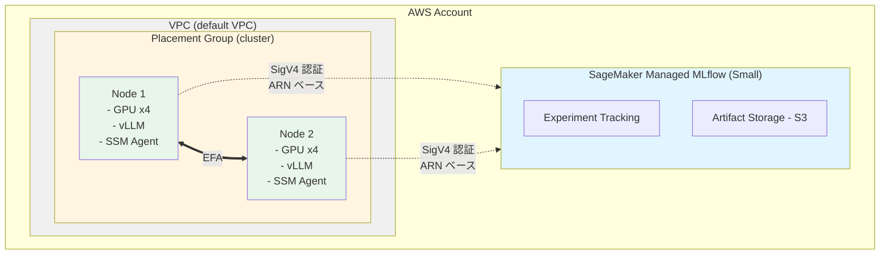

# AWS EFA と MLflow で構築する分散推論実験環境

## はじめに

Large Language Model (LLM) の推論は、(1) 入力プロンプトを処理する **Prefill フェーズ**と (2) トークンを逐次生成する **Decode フェーズ**に分かれます。**Disaggregated Inference** は、この 2 つのフェーズを異なる GPU ノードに分離し、中間状態 (KV-Cache) をネットワーク経由で転送するアーキテクチャです。これにより、各フェーズに最適なリソース配分が可能になります。

本記事では、Disaggregated Inference の実験基盤として、AWS Elastic Fabric Adapter (EFA) を活用した GPU クラスタ環境を AWS CDK で構築します。あわせて、実験管理に SageMaker Managed MLflow を統合し、パラメータとメトリクスを体系的に記録できる環境を整えます。

### 本記事で構築する環境

- **SageMaker Managed MLflow**: 実験パラメータとメトリクスの一元管理
- **EFA 対応 GPU インスタンス**: 低レイテンシ・高スループットの 2 ノード構成
- **検証スクリプト**: 環境の正常性を確認するツール

### 対象読者

- AWS でディープラーニング実験環境を構築する方
- EFA による高速ノード間通信を試したい方
- MLflow で実験を体系的に管理したい方

### 前提知識

- AWS の基礎知識 (EC2, VPC, IAM, CloudFormation)
- AWS CDK の基本操作
- Python と bash の基本的な読み書き

## アーキテクチャ

構築する環境の全体像：



**注**: GPU 数はデフォルトインスタンス (g5.12xlarge: A10G x4) の場合

### 主要コンポーネントと選定理由

**SageMaker Managed MLflow**

マネージド型の MLflow tracking server。Small/Medium/Large の 3 つのサイズから選択でき、サーバー運用が不要です。S3 にアーティファクトを永続化し、IAM ベースのアクセス制御により、チーム間でも安全に実験データを共有できます。本記事では Small サイズ（最大 25 ユーザー、TPS 25）を使用します。

**EFA (Elastic Fabric Adapter)**

AWS が提供する高性能ネットワークインターフェース。OS のカーネルバイパスにより、通常の TCP/IP 通信と比べてレイテンシを大幅に削減します。Disaggregated Inference では KV-Cache の転送がボトルネックとなるため、EFA による低レイテンシ通信が重要です。

**Placement Group (cluster 戦略)**

同一 Availability Zone 内の物理的に近接したラックにインスタンスを配置することで、ネットワークのホップ数を最小化し、EFA の性能を引き出します。

**SSM Session Manager**

SSH keypair やポート 22 の開放が不要で、IAM ベースで安全にインスタンスへアクセスできます。CloudTrail でアクセスログが記録されるため、監査要件を満たします。

## 前提条件

### ローカル環境

以下がインストールされていること：

```bash
# バージョン確認
node --version      # v18 以上
aws --version       # AWS CLI v2
cdk --version       # AWS CDK v2
python3 --version   # Python 3.9 以上
```

### AWS 環境

- AWS CLI の認証設定 (`aws sts get-caller-identity` で確認)
- 適切な IAM 権限 (EC2, VPC, SageMaker, CloudFormation)
- EC2 容量制限の確認 (後述)

### Session Manager Plugin のインストール

インスタンスへのアクセスに使用します。

#### macOS

```bash
brew install --cask session-manager-plugin
session-manager-plugin --version
```

#### Ubuntu/Debian

```bash
curl "https://s3.amazonaws.com/session-manager-downloads/plugin/latest/ubuntu_64bit/session-manager-plugin.deb" -o "session-manager-plugin.deb"
sudo dpkg -i session-manager-plugin.deb
session-manager-plugin --version
```

#### Amazon Linux/RHEL/CentOS

```bash
curl "https://s3.amazonaws.com/session-manager-downloads/plugin/latest/linux_64bit/session-manager-plugin.rpm" -o "session-manager-plugin.rpm"
sudo yum install -y session-manager-plugin.rpm
```

## 実装手順

### 1. リポジトリのクローン

```bash
git clone https://github.com/<your-username>/disaggregated-inference-with-nixl-over-aws-efa.git
cd disaggregated-inference-with-nixl-over-aws-efa
```

### 2. AWS 認証情報の確認

```bash
aws sts get-caller-identity
```

アカウント ID とユーザー/ロール情報が表示されることを確認してください。

### 3. リージョンと Availability Zone の設定

```bash
export AWS_DEFAULT_REGION=us-east-1
export CDK_DEFAULT_REGION=us-east-1
export CDK_DEFAULT_ACCOUNT=$(aws sts get-caller-identity --query Account --output text)
```

**重要**: このプロジェクトでは `us-east-1` リージョンを使用します。他のリージョンを使用する場合は、上記の環境変数と後続のデプロイコマンドを変更してください。

**補足**: これらの環境変数は現在のシェルセッションでのみ有効です。新しいターミナルを開いた場合は再度設定してください。永続化する場合は `~/.bashrc` や `~/.zshrc` に追記します。

### 4. EC2 容量制限の確認

大型 GPU インスタンスは容量制限に注意が必要です。g5.12xlarge は 1 インスタンスあたり 48 vCPU を使用します。本構成では 2 ノードのため、最低 96 vCPU が必要です。

```bash
# Running On-Demand G and VT instances の vCPU 上限を確認
aws service-quotas get-service-quota \
  --service-code ec2 \
  --quota-code L-DB2E81BA \
  --region us-east-1 \
  --query 'Quota.Value' \
  --output text
```

表示された値が `96` 未満の場合は、AWS Service Quotas コンソールから引き上げリクエストを送信してください。引き上げには数時間から数日かかる場合があります。

### 5. CDK プロジェクトのセットアップ

```bash
cd cdk
npm install
```

### 6. CDK のブートストラップ

初回のみ実行：

```bash
npx cdk bootstrap
```

成功すると `CDKToolkit` スタックが作成されます。

### 7. スタックのデプロイ

```bash
npx cdk deploy --all \
  --context availabilityZone=us-east-1a \
  --context trackingServerName=nixl-efa-mlflow
```

デプロイには 10〜15 分かかります（環境により異なります）。完了すると以下の出力が表示されます：

```
Outputs:
MlflowTrackingServerStack.TrackingServerArn = arn:aws:sagemaker:us-east-1:123456789012:mlflow-tracking-server/nixl-efa-mlflow
NixlEfaStack.Node1PublicIp = 3.80.45.55
NixlEfaStack.Node2PublicIp = 18.232.147.93
NixlEfaStack.Node1PrivateIp = 172.31.27.100
NixlEfaStack.Node2PrivateIp = 172.31.27.101
```

**重要**: `TrackingServerArn` の値は後で使用するため、控えておいてください。プライベート IP アドレスはお使いの VPC 設定により異なります。

### 8. デプロイ情報の取得

デプロイ完了後、インスタンス ID と IP アドレスを取得します。

```bash
# Node1 のインスタンス ID を取得
NODE1_ID=$(aws ec2 describe-instances \
  --region us-east-1 \
  --filters "Name=tag:Name,Values=nixl-node1" "Name=instance-state-name,Values=running" \
  --query 'Reservations[0].Instances[0].InstanceId' \
  --output text)

# Node2 のインスタンス ID を取得
NODE2_ID=$(aws ec2 describe-instances \
  --region us-east-1 \
  --filters "Name=tag:Name,Values=nixl-node2" "Name=instance-state-name,Values=running" \
  --query 'Reservations[0].Instances[0].InstanceId' \
  --output text)

# Node2 のプライベート IP を取得
NODE2_PRIVATE_IP=$(aws ec2 describe-instances \
  --region us-east-1 \
  --filters "Name=tag:Name,Values=nixl-node2" "Name=instance-state-name,Values=running" \
  --query 'Reservations[0].Instances[0].PrivateIpAddress' \
  --output text)

# 情報を表示
echo "Node1 Instance ID: $NODE1_ID"
echo "Node2 Instance ID: $NODE2_ID"
echo "Node2 Private IP: $NODE2_PRIVATE_IP"
```

これらの値を後の手順で使用します。

### 9. インスタンスへの接続

SSM Session Manager でインスタンスに接続します。

```bash
# Node 1 のインスタンス ID をタグから取得
NODE1_ID=$(aws ec2 describe-instances \
  --filters "Name=tag:Name,Values=nixl-node1" "Name=instance-state-name,Values=running" \
  --query 'Reservations[0].Instances[0].InstanceId' \
  --output text)

echo "Node1 Instance ID: $NODE1_ID"

# 接続
aws ssm start-session --target $NODE1_ID
```

接続が成功すると、以下のプロンプトが表示されます：

```
Starting session with SessionId: user-0123456789abcdef0
sh-5.1$
```

bash に切り替えます：

```bash
bash
```

セッションを終了するには `exit` を 2 回入力します（1 回目で bash を終了、2 回目で SSM セッションを終了）。

### 9b. 環境変数の設定

CDK デプロイ時に User Data で `/etc/environment` に `MLFLOW_TRACKING_ARN` が書き込まれます。SSM Session Manager 経由ではログインシェルのプロファイルが実行されないため、環境変数を手動で読み込む必要があります。

```bash
# インスタンス上で実行
source /etc/environment
echo $MLFLOW_TRACKING_ARN  # ARN が表示されることを確認
```

毎回 `source` するのが手間な場合は、`.bashrc` に追記しておくと便利です：

```bash
echo 'source /etc/environment' >> ~/.bashrc
```

### 10. 環境確認スクリプトの実行

インスタンス上でリポジトリをクローンし、検証スクリプトを実行します。

```bash
# インスタンス上で実行
cd /tmp
git clone https://github.com/<your-username>/disaggregated-inference-with-nixl-over-aws-efa.git
cd disaggregated-inference-with-nixl-over-aws-efa/scripts

# 実行権限を付与
chmod +x check-environment.sh

# Node 2 のプライベート IP を環境変数に設定
export NODE2_PRIVATE_IP=172.31.27.101  # デプロイ出力の値に置き換える

# 実行
./check-environment.sh
```

初回実行では、vLLM と NIXL がまだインストールされていないため、一部チェックが FAIL します。EFA、GPU、MLflow、ネットワークのチェックがすべて PASS していれば、環境構築は正常です：

```
==========================================
Summary
==========================================
Checks passed: 10
Checks failed: 3

Some checks failed. Please review the output above.
```

vLLM と NIXL のインストールは次回の記事で扱います。

### 10b. Node 2 の環境検証

Node 2 でも同様に環境を確認します。

```bash
# ローカルから Node 2 に接続
NODE2_ID=$(aws ec2 describe-instances \
  --filters "Name=tag:Name,Values=nixl-node2" "Name=instance-state-name,Values=running" \
  --query 'Reservations[0].Instances[0].InstanceId' \
  --output text)

echo "Node2 Instance ID: $NODE2_ID"

# 接続
aws ssm start-session --target $NODE2_ID
```

```bash
# Node 2 のインスタンス上で実行
bash
source /etc/environment

cd /tmp
git clone https://github.com/<your-username>/disaggregated-inference-with-nixl-over-aws-efa.git
cd disaggregated-inference-with-nixl-over-aws-efa/scripts

# Node 1 のプライベート IP を設定（Node 2 から Node 1 への接続を確認）
export NODE2_PRIVATE_IP=172.31.27.100  # ここには Node 1 のプライベート IP を設定

chmod +x check-environment.sh
./check-environment.sh
```

**補足**: 環境変数名 `NODE2_PRIVATE_IP` は、スクリプト内でピア (peer) ノードの IP を指定するために使用されます。Node 2 から実行する場合、ピアは Node 1 となるため、Node 1 のプライベート IP を設定してください。

### 11. NCCL 通信ベンチマーク

EFA の実効性能を確認するため、NCCL 通信ベンチマークを実行します。

#### 11.1. NCCL tests のセットアップ

Node 1 で NCCL tests をインストールします。

```bash
# インスタンス上で実行
cd /tmp/disaggregated-inference-with-nixl-over-aws-efa/scripts

# NCCL tests のセットアップ（初回のみ）
sudo bash setup-nccl-tests.sh
```

このスクリプトは、まず依存パッケージ（build-essential, libopenmpi-dev など）をインストールした後、NCCL コアライブラリ（libnccl2, libnccl-dev）を追加します。次に NVIDIA の公式リポジトリから NCCL tests をクローンし、MPI サポートを有効にしてビルドします。インストールが完了すると、`/opt/nccl-tests/build/` 配下に各種ベンチマークツールが生成されます。

#### 11.2. ベンチマークの実行

```bash
# Node 1 で実行
bash nccl-benchmark.sh
```

デフォルトでは、**all_reduce**（すべての GPU でデータを集約し、結果を全 GPU に配布する操作）と **all_gather**（すべての GPU からデータを収集し、全 GPU に配布する操作）の 2 つの NCCL collective operation を測定します。

測定パラメータ（カスタマイズ可能）：

```bash
# GPU 数を指定
NUM_GPUS=2 bash nccl-benchmark.sh

# データサイズ範囲を指定
MIN_SIZE=1M MAX_SIZE=64M bash nccl-benchmark.sh

# ステップファクターを指定
STEP_FACTOR=4 bash nccl-benchmark.sh
```

#### 11.3. 測定結果

今回の環境（g5.12xlarge、4x NVIDIA A10G、TCP モード）での測定結果：

**All-Reduce ベンチマーク**:

| データサイズ | 時間 (μs) | Alg BW (GB/s) | Bus BW (GB/s) |
|--------------|-----------|---------------|---------------|
| 8 B          | 51.52     | 0.00          | 0.00          |
| 128 MB       | 65240.6   | 2.06          | 3.09          |
| 平均         | -         | -             | **1.47**      |

**All-Gather ベンチマーク**:

| データサイズ | 時間 (μs) | Alg BW (GB/s) | Bus BW (GB/s) |
|--------------|-----------|---------------|---------------|
| 64 B         | 29.98     | 0.00          | 0.00          |
| 128 MB       | 33139.1   | 4.05          | 3.04          |
| 平均         | -         | -             | **1.37**      |

**測定結果の詳細**:

```
[all_reduce]
   134217728 bytes (128 MB):  65240.6 μs,  2.06 GB/s (Alg BW),  3.09 GB/s (Bus BW)
    67108864 bytes (64 MB):   31157.6 μs,  2.15 GB/s (Alg BW),  3.23 GB/s (Bus BW)
    33554432 bytes (32 MB):   15236.2 μs,  2.20 GB/s (Alg BW),  3.30 GB/s (Bus BW)

[all_gather]
   134217728 bytes (128 MB):  33139.1 μs,  4.05 GB/s (Alg BW),  3.04 GB/s (Bus BW)
    67108864 bytes (64 MB):   15800.0 μs,  4.25 GB/s (Alg BW),  3.19 GB/s (Bus BW)
    33554432 bytes (32 MB):    7731.17 μs,  4.34 GB/s (Alg BW),  3.26 GB/s (Bus BW)
```

結果ファイルは `/tmp/nccl-benchmark-results/` に保存されます：

- `all_reduce_TCP_YYYYMMDD_HHMMSS.txt`
- `all_gather_TCP_YYYYMMDD_HHMMSS.txt`

**注意**: この測定では EFA デバイスが検出されず、TCP モードで実行されました。EFA を有効化するには、以下の環境変数を設定してください：

```bash
export FI_PROVIDER=efa
export FI_EFA_USE_DEVICE_RDMA=1
export NCCL_DEBUG=INFO

bash nccl-benchmark.sh
```

EFA が正常に動作している場合、ファイル名に `_EFA_` が含まれ、帯域幅が大幅に向上します（10+ GB/s）。

### 12. MLflow 接続テスト

MLflow への接続を確認します。SageMaker Managed MLflow への接続には `sagemaker-mlflow` プラグインが必要です。このプラグインが **SigV4 認証**を自動処理するため、presigned URL の手動取得は不要です。

#### 12.1. 依存パッケージのインストール

```bash
# インスタンス上で実行
cd /tmp/disaggregated-inference-with-nixl-over-aws-efa/scripts

# sagemaker-mlflow プラグインと依存パッケージをインストール
bash install-mlflow-deps.sh
```

`install-mlflow-deps.sh` は、まず `sagemaker-mlflow` プラグイン（依存関係として `mlflow` と `boto3` を含む）をインストールします。次に MLflow プラグインのエントリポイントが正しく登録されているか確認し、AWS 認証情報が利用可能であることを検証します。最後に `MLFLOW_TRACKING_ARN` 環境変数が設定されているかを確認します。

**仕組み**: `sagemaker-mlflow` プラグインは MLflow のプラグインシステムに 3 つのエントリポイントを登録します。`mlflow.tracking_store` は ARN から SageMaker MLflow エンドポイント URL を構築し、`mlflow.request_auth_provider` は各 API リクエストに SigV4 認証ヘッダーを自動付与し、`mlflow.request_header_provider` は `x-mlflow-sm-tracking-server-arn` ヘッダーを追加します。これにより、tracking URI に ARN を設定するだけで、認証が透過的に処理されます。

#### 12.2. 接続テストの実行

```bash
# 環境変数の確認（SSM セッションでは手動で読み込む必要あり）
source /etc/environment
echo $MLFLOW_TRACKING_ARN

# 接続テスト（scripts ディレクトリ内で実行すること）
python3 test-mlflow.py
```

**補足**: `test-mlflow.py` は同ディレクトリの `mlflow_helper.py` をインポートするため、必ず `scripts/` ディレクトリ内から実行してください。

成功すると以下の出力が表示されます（実際の測定結果）：

```
================================================================================
MLflow Connectivity Test
================================================================================

[STEP 1] Setting up MLflow tracking...
[INFO] MLflow tracking URI を設定しました
  Server:   nixl-efa-mlflow
  Region:   us-east-1
  Type:     mlflow-tracking-server
  Auth:     SigV4 (sagemaker-mlflow plugin)
  Status:   [OK] 接続成功
  Tracking URI (ARN): arn:aws:sagemaker:us-east-1:776010787911:mlflow-tracking-server/nixl-efa-mlflow

[STEP 2] Creating/getting experiment: nixl-efa-test
2026/02/26 02:56:06 INFO mlflow.tracking.fluent: Experiment with name 'nixl-efa-test' does not exist. Creating a new experiment.
  Experiment ID: 1
  Artifact Location: s3://mlflow-prod-east-1-mlflowartifactbucket43798744-as7yhc43kxgl/mlflow-artifacts/1

[STEP 3] Starting test run...
  Run ID: 87d08e9a758d4da289aced184aaedf39

[STEP 4] Logging parameters...
  - backend: tcp
  - prompt_tokens: 128
  - max_tokens: 128
  - concurrency: 1
  - engine: vllm
  - model: test-model
  - test_type: connectivity

[STEP 5] Logging metrics...
  - ttft_mean: 100.5
  - ttft_p50: 98.2
  - ttft_p95: 120.3
  - ttft_p99: 145.7
  - tpot_mean: 10.2
  - tpot_p50: 9.8
  - throughput_tokens_per_sec: 500.0

[STEP 6] Logging tags...

[STEP 7] Retrieving and verifying run...
  Verifying parameters...
    [OK] All parameters verified
  Verifying metrics...
    [OK] All metrics verified

[STEP 8] Listing recent runs in experiment...
  Found 1 recent run(s):
    1. Run ID: 87d08e9a758d4da289aced184aaedf39
       Name: connectivity_test_20260226_025607
       Status: FINISHED
       Start Time: 2026-02-26 02:56:07.718000

================================================================================
[SUCCESS] All MLflow connectivity tests passed!
================================================================================
```

### 13. MLflow UI での確認

1. AWS Console → SageMaker → MLflow Tracking Servers
2. "nixl-efa-mlflow" を選択
3. "Open MLflow UI" をクリック
4. 左メニューの "Experiments" から "nixl-efa-test" を選択
5. 記録されたランが表示されることを確認

## 技術的な実装ポイント

以下は CDK 実装の技術的なポイントです。環境構築の手順としては不要ですが、実装の背景を理解する際の参考にしてください。

### sagemaker-mlflow プラグインによる SigV4 認証

SageMaker Managed MLflow への接続には `sagemaker-mlflow` プラグインを使用します。このプラグインは MLflow のプラグインシステム（entry_points）を通じて自動的に有効化され、tracking URI に ARN を設定するだけで SigV4 認証が透過的に処理されます。

**実装の抜粋 (scripts/mlflow_helper.py)**:

```python
def setup_mlflow_tracking(tracking_arn=None):
    arn = tracking_arn or os.environ.get("MLFLOW_TRACKING_ARN")

    # sagemaker-mlflow プラグインが自動的に以下を処理:
    # 1. ARN からエンドポイント URL を構築
    # 2. 各リクエストに SigV4 認証ヘッダーを付与
    # 3. x-mlflow-sm-tracking-server-arn ヘッダーを追加
    os.environ["MLFLOW_TRACKING_URI"] = arn
    mlflow.set_tracking_uri(arn)

    return arn
```

**注**: presigned URL 方式はブラウザ用の Web UI アクセス向けであり、Python クライアントからの API アクセスには `sagemaker-mlflow` プラグインの SigV4 認証を使用します。

### EFA の有効化

CDK で EFA を有効化するには、`CfnNetworkInterface` の `interfaceType` を `"efa"` に設定します。

**実装 (cdk/lib/nixl-efa-stack.ts)**: *

```typescript
const node1Efa = new ec2.CfnNetworkInterface(this, "Node1EfaInterface", {
  subnetId: subnet.subnetId,
  groupSet: [securityGroup.securityGroupId],
  interfaceType: "efa",
});

const node1 = new ec2.CfnInstance(this, "Node1", {
  imageId: ami.getImage(this).imageId,
  instanceType,  // デフォルト: g5.12xlarge
  placementGroupName: placementGroup.ref,
  networkInterfaces: [{
    networkInterfaceId: node1Efa.ref,
    deviceIndex: "0",
  }],
});
```

### EFA Security Group の設定

EFA は TCP 以外のプロトコルも使用するため、同一 Security Group 内のインスタンス間で全トラフィックを許可します。

```typescript
this.securityGroup.addIngressRule(
  this.securityGroup,  // ソースは同じ Security Group
  ec2.Port.allTraffic(),
  "All traffic within security group for EFA"
);
```

このルールは、同じ Security Group に属するインスタンス間のみの通信を許可するため、セキュリティリスクは限定的です。

## トラブルシューティング

### EFA デバイスが検出されない

**症状**: *`check-environment.sh` で EFA チェックが失敗

**対処法**: *

```bash
# インスタンスタイプを確認
aws ec2 describe-instances \
  --instance-ids $NODE1_ID \
  --query 'Reservations[0].Instances[0].InstanceType' \
  --output text
```

EFA 対応インスタンスタイプ: p4d.24xlarge, p5.48xlarge, g5.12xlarge, g5.24xlarge など。

### MLflow 接続エラー

**症状**: `test-mlflow.py` が "AccessDenied" または "403" で失敗

**対処法**:

インスタンスの IAM ロールに以下の 2 つのポリシーが含まれているか確認してください。SageMaker Managed MLflow はコントロールプレーン（`sagemaker:*`）とデータプレーン（`sagemaker-mlflow:*`）で別々の IAM アクションを使用します。

コントロールプレーン（presigned URL 生成や tracking server 情報の取得）:

```json
{
  "Effect": "Allow",
  "Action": [
    "sagemaker:DescribeMlflowTrackingServer",
    "sagemaker:CreatePresignedMlflowTrackingServerUrl"
  ],
  "Resource": "*"
}
```

データプレーン（実験・ラン・メトリクスの読み書き）:

```json
{
  "Effect": "Allow",
  "Action": "sagemaker-mlflow:*",
  "Resource": "*"
}
```

本プロジェクトの CDK 実装には両方とも含まれています。

### インスタンス起動失敗 (Insufficient capacity)

**症状**: *CDK デプロイ時に容量不足エラー

**対処法**: *

別の Availability Zone を試す：

```bash
npx cdk deploy --all \
  --context availabilityZone=us-east-1b \
  --context trackingServerName=nixl-efa-mlflow
```

別のインスタンスタイプを指定する場合：

```bash
npx cdk deploy --all \
  --context instanceType=g5.24xlarge \
  --context availabilityZone=us-east-1a \
  --context trackingServerName=nixl-efa-mlflow
```

**注**: EFA 対応の g5 インスタンスは g5.12xlarge 以上です。g5.xlarge、g5.2xlarge、g5.4xlarge、g5.8xlarge は EFA に対応していません。

### SSM Session Manager に接続できない

**症状**: *"TargetNotConnected" エラー

**対処法**: *

```bash
# インスタンスの SSM 接続状態を確認
aws ssm describe-instance-information \
  --filters "Key=InstanceIds,Values=$NODE1_ID"
```

SSM エージェントの起動には数分かかる場合があります。`PingStatus` が `Online` になるまで待ってください。

### User Data の実行失敗

**症状**: *`MLFLOW_TRACKING_ARN` が設定されない

**対処法**: *

```bash
# インスタンス上で cloud-init ログを確認
sudo cat /var/log/cloud-init-output.log | grep MLFLOW
```

User Data の実行エラーが記録されています。

## クリーンアップ

```bash
cd cdk
npx cdk destroy --all
```

確認プロンプトで `y` を入力します。

**重要**: *SageMaker Managed MLflow が作成した S3 バケットは手動で削除が必要です。

```bash
# MLflow のアーティファクト用バケットを確認
aws s3 ls | grep mlflow

# バケットを削除
aws s3 rb s3://<bucket-name> --force
```

## まとめ

本記事では、AWS CDK を使用して以下を構築しました：

- **SageMaker Managed MLflow**: *実験の体系的な管理が可能に
- **EFA 対応 GPU クラスタ**: 低レイテンシの KV-Cache 転送環境
- **SSM Session Manager**: *安全なアクセス環境

この環境により、Disaggregated Inference の性能を正確に測定し、MLflow で実験結果を管理できるようになりました。次回は、vLLM を使用した分散推論の実装と実験実行について解説します。

## 参考資料

- [AWS EFA Documentation](https://docs.aws.amazon.com/AWSEC2/latest/UserGuide/efa.html)
- [SageMaker Managed MLflow](https://docs.aws.amazon.com/sagemaker/latest/dg/mlflow.html)
- [AWS Systems Manager Session Manager](https://docs.aws.amazon.com/systems-manager/latest/userguide/session-manager.html)
- [AWS CDK v2 Guide](https://docs.aws.amazon.com/cdk/v2/guide/home.html)
