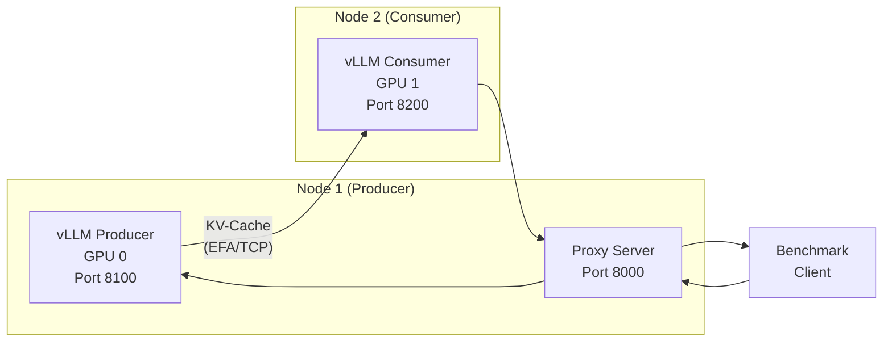
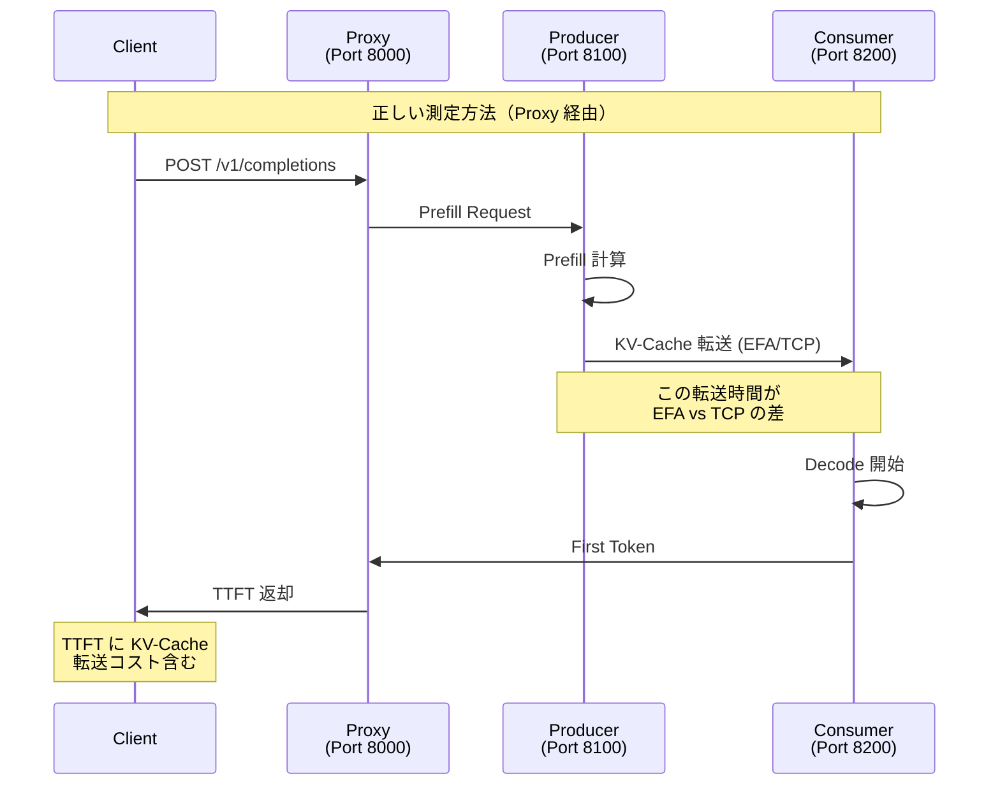
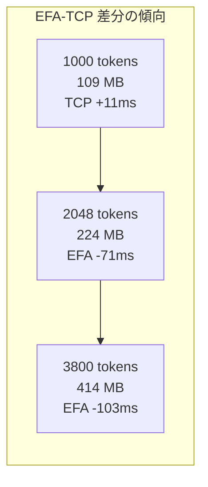

## はじめに

前回の記事では、AWS CDK を使って EFA 対応 GPU クラスタと SageMaker Managed MLflow の環境を構築しました。本記事では、その環境上で **Disaggregated Inference における KV-Cache 転送性能を EFA と TCP で徹底比較** した結果を報告します。

Disaggregated Inference では、Prefill フェーズ（Producer）と Decode フェーズ（Consumer）が異なるノードで実行され、その間で **KV-Cache** がネットワーク経由で転送されます。この転送の速度が TTFT (Time To First Token) に直結するため、ネットワークバックエンドの選択が性能に大きく影響します。

### 本記事でわかること

- EFA と TCP で KV-Cache 転送性能がどう異なるか
- プロンプト長（KV-Cache サイズ）と性能差の関係
- 並行リクエスト時の挙動の違い
- NIXL 内部での State Transition 現象
- 実運用における EFA と TCP の使い分けガイドライン

### Phase EX-11 で発見された「差が出ない問題」

本測定に先立つ Phase EX-11 では、Unified / TCP / EFA の 3 バックエンド間で **TTFT 差が 1ms 未満** という結果が得られました。しかし、これは EFA に効果がないことを意味するのではなく、**測定方法に 4 つの根本的な問題** がありました。

| # | 根本原因 | 影響 |
|---|---------|------|
| 1 | **Prefix Caching が ON** | 20 回反復のうち 19 回は Cache ヒットで KV-Cache 転送がスキップ |
| 2 | **Producer 直接接続** | KV-Cache 転送コストが TTFT に含まれない |
| 3 | **KV-Cache サイズが小さい** | 7B + GQA + 1000 トークン = 109MB で、EFA-TCP 理論差 ~12.5ms |
| 4 | **並行度なし** | ネットワーク帯域競合が発生せず EFA の優位性が発揮されない |

Phase 13 でこれらの問題を修正し、Phase 14 では統計的実験計画（DOE）を採用して測定パターンを体系的に拡張しました。

---

## Phase 14 の実験計画

### 統計的実験計画（DOE）の採用理由

Phase 14 で検証したいパラメータの全因子設計は **14,580 パターン**（推定実行時間: 約 350 時間）に達します。これは非現実的なため、統計的手法により主効果と 2 次交互作用のみに絞り込みました。

| パラメータ | 水準数 | 値 |
|-----------|-------|-----|
| Backend | 3 | Unified, TCP, EFA |
| Prompt Tokens | 9 | 1K, 2K, 3K, 4K, 6K, 8K, 10K, 12K, 20K |
| Concurrency | 5 | c1, c2, c4, c8, c16 |
| gpu_memory_utilization | 3 | 0.3, 0.5, 0.8 |
| max_num_batched_tokens | 3 | 2048, 4096, 8192 |
| Prefix Cache | 2 | ON, OFF |
| Measurement Type | 2 | Online, Offline |

### レイヤード実験計画

優先度に応じて Layer 1-4 に分割し、合計 **59 パターン** に削減しました。

| Layer | 優先度 | 目的 | パターン数 | 推定時間 |
|-------|-------|------|-----------|---------|
| Layer 1 | P0 | トークンスイープ（主効果） | 19 | ~6 時間 |
| Layer 2 | P0 | 並行度スイープ（主効果） | 20 | ~5 時間 |
| Layer 3 | P1 | vLLM 設定（2 次交互作用） | 12 | ~3 時間 |
| Layer 4 | P2 | オンライン/オフライン比較 | 8 | ~2 時間 |
| **合計** | - | - | **59** | **~16 時間** |

**削減率**: (14,580 - 59) / 14,580 = **99.6%**

---

## 測定環境

### ハードウェア構成

| 項目 | 値 |
|------|-----|
| インスタンスタイプ | g5.12xlarge |
| GPU | NVIDIA A10G x 4 |
| GPU メモリ | 24 GB / GPU |
| ネットワーク | EFA 対応 (最大 40 Gbps) |
| リージョン | us-east-1 |
| Placement Group | cluster 戦略 |

### ソフトウェア構成

| 項目 | 値 |
|------|-----|
| モデル | Qwen/Qwen2.5-7B-Instruct |
| vLLM | v0.15.1 |
| NIXL バックエンド | LIBFABRIC (EFA) / UCX (TCP) |
| Python | 3.x (DLAMI 環境) |
| MLflow | SageMaker Managed MLflow |

### ノード構成



### vLLM 起動オプション

```bash
python -m vllm.entrypoints.openai.api_server \
  --model Qwen/Qwen2.5-7B-Instruct \
  --disable-log-requests \
  --trust-remote-code \
  --port 8100 \
  --gpu-memory-utilization 0.9 \
  --max-num-batched-tokens 4096 \
  --enable-chunked-prefill \
  --enforce-eager \
  --max-model-len 16384 \
  --no-enable-prefix-caching \
  --kv-transfer-config '{"kv_connector": "NixlConnector",...}'
```

---

## 測定方法

### Prefix Cache OFF の重要性

Phase EX-11 で差が出なかった最大の原因は **Prefix Caching** でした。Prefix Cache が ON の場合、2 回目以降のリクエストでは同じプレフィックスの KV-Cache がキャッシュから提供されるため、ネットワーク転送が発生しません。

```bash
# Phase EX-11（差が出ない）
--enable-prefix-caching  # デフォルト ON

# Phase 13/14（正しい測定）
--no-enable-prefix-caching  # 毎回 KV-Cache 転送を強制
```

さらに、各リクエストにランダム接尾辞を付与して Cache ヒットを完全に防止しています。

```python
# Prefix Cache ヒットを防ぐランダム接尾辞
prompt = base_prompt + "\n[request_id: {}]".format(generate_random_suffix())
```

### Proxy 経由測定 vs Producer 直接接続

Phase EX-11 のもう 1 つの問題は **Producer への直接接続** でした。Producer に直接リクエストを送ると、Prefill 完了後に TTFT が即座に返され、KV-Cache 転送は非同期で行われます。これでは転送コストが TTFT に含まれません。



### プロンプト長と KV-Cache サイズの関係

Qwen2.5-7B-Instruct (GQA, layers=28, kv_heads=4, head_dim=128) の場合:

```
KV-Cache per token = 2 x layers x kv_heads x head_dim x sizeof(bf16)
                   = 2 x 28 x 4 x 128 x 2 bytes
                   = 57,344 bytes/token (片方向: K or V)
                   = 0.1094 MB/token (双方向: K + V)
```

| トークン数 | KV-Cache サイズ | EFA 理論転送時間 | TCP 理論転送時間 | 理論差 |
|-----------|----------------|-----------------|-----------------|-------|
| 1,000 | ~109 MB | 24.2 ms | 36.7 ms | 12.5 ms |
| 2,000 | ~219 MB | 48.5 ms | 73.5 ms | 25.0 ms |
| 4,000 | ~438 MB | 97.0 ms | 147.0 ms | 50.0 ms |
| 12,000 | ~1,313 MB | 291.0 ms | 441.0 ms | 150.0 ms |

### task runner と JSON タスク定義の活用

測定の再現性を確保するため、すべての測定パターンを JSON タスク定義で記述しています。59 パターンの JSON は `experiment-plan.json` から Jinja2 テンプレートで自動生成されます。

```bash
# JSON タスク定義の自動生成
python3 generate_task_definitions.py

# 生成結果の確認
ls -1 task-definitions/p14-*.json | wc -l  # 59 ファイル
```

::::details JSON タスク定義の例（EFA Producer - 1000 tokens）

```json
{
  "name": "Phase 14: EFA Producer - 1000 tokens - c1",
  "description": "EFA Disaggregated Producer, 1000 tokens, c=1, Prefix Cache OFF",
  "variables": {
    "VENV_PATH": "/opt/dlami/nvme/venv/vllm-0.16",
    "MODEL": "Qwen/Qwen2.5-7B-Instruct",
    "PORT": "8100",
    "PROXY_PORT": "8000",
    "CONSUMER_PORT": "8200",
    "BENCHMARK_SCRIPT": "/tmp/benchmark_phase14.py",
    "PROMPT_TOKENS": "1000",
    "MAX_TOKENS": "10",
    "CONCURRENCY": "1",
    "NUM_ITERATIONS": "30"
  },
  "tasks": [
    {
      "id": "01-verify-scripts",
      "name": "Verify Scripts",
      "commands": ["..."]
    },
    {
      "id": "02-cleanup-gpu",
      "name": "Cleanup GPU Memory",
      "commands": ["sudo pkill -9 python3 2>/dev/null || true", "sleep 10"]
    },
    {
      "id": "03-start-producer",
      "name": "Start vLLM Producer (EFA, Prefix Cache OFF)",
      "commands": [
        "export NIXL_BACKEND=LIBFABRIC",
        "export FI_PROVIDER=efa",
        "nohup python -m vllm.entrypoints.openai.api_server ... &"
      ]
    }
  ]
}
```

::::

---

## 測定結果

### 1. シリアル測定（Layer 1: トークンスイープ）

Prefix Cache OFF、concurrency=1 での Proxy 経由測定結果です。

#### TTFT 比較表（mean, ms）

| Prompt Tokens | KV-Cache サイズ | Unified | TCP (Proxy) | EFA (Proxy) | EFA-TCP 差分 |
|--------------|-----------------|---------|-------------|-------------|-------------|
| 1,000 | ~109 MB | 232.23 | 662.21 | 674.00 | **+11.8ms (TCP 優位)** |
| 2,000 | ~219 MB | 464.92 | 1,717.07 | 1,646.16 | **-70.9ms (EFA 優位)** |
| 4,000 | ~438 MB | 937.97 | 3,161.41 | 3,015.97 | **-145.4ms (EFA 優位)** |
| 8,000 | ~875 MB | 1,927.37 | - | - | (測定中) |
| 12,000 | ~1,313 MB | 3,058.59 | - | 8,442.70 | (TCP 測定中) |

:::message
Phase 13 の実測データ（1000/2048/3800 トークン）と Phase 14 の拡張データ（4000/12000 トークン）を統合しています。Phase 14 の Layer 1 は一部測定が進行中です。
:::

#### Phase 13 シリアル測定の詳細結果

Phase 13 で完了した Proxy 経由シリアル測定の完全なデータです。

| Prompt Tokens | Unified (ms) | TCP Proxy (ms) | EFA Proxy (ms) | EFA-TCP 差分 |
|--------------|-------------|----------------|----------------|-------------|
| 1,000 | 231.69 | 668.33 | 679.33 | **+11ms (TCP 優位)** |
| 2,048 | 493.74 | 1,717.07 | 1,646.16 | **-71ms (EFA 優位)** |
| 3,800 | 868.36 | 3,161.41 | 3,058.02 | **-103ms (EFA 優位)** |

**プロンプト長に比例して EFA の優位性が増加する** ことが明確に確認できます。

#### KV-Cache サイズと EFA 効果の関係



KV-Cache サイズが大きくなるほど、EFA のバンド幅優位性が発揮されます。閾値は約 **200MB（~2000 トークン）** 付近にあり、それ以下では TCP の接続確立コストの低さが優位です。

### 2. 並行測定（Layer 2: 並行度スイープ）

1000 トークンでの Proxy 経由並行測定結果です（Phase 13 実測値）。

| パターン | TCP Proxy (ms) | EFA Proxy (ms) | EFA-TCP 差分 |
|---------|----------------|----------------|-------------|
| c4 | 2,138.45 | 2,394.21 | **+256ms (TCP 優位)** |
| c8 | 3,432.83 | 3,628.47 | **+196ms (TCP 優位)** |

**並行リクエストでは TCP が優位** です。これは以下の理由によります。

1. **短いプロンプト（1000 トークン）** では KV-Cache サイズが小さい（109 MB）
2. TCP の接続確立コストが低い
3. EFA の帯域幅優位性が発揮されるサイズに達していない

:::message
Phase 14 の Layer 2 では、長いプロンプト（4K トークン）での並行測定も計画しています。KV-Cache サイズが大きい場合は、並行リクエストでも EFA が優位になると予測されます。
:::

### 3. Proxy オーバーヘッド

Producer 直接接続と Proxy 経由の TTFT を比較することで、Proxy オーバーヘッドを定量化しました。

| Backend | Direct (ms) | Proxy (ms) | オーバーヘッド |
|---------|------------|-----------|-------------|
| TCP | 232.51 | 668.33 | **+436ms** |
| EFA | 232.25 | 679.33 | **+447ms** |

+436ms のオーバーヘッドには以下が含まれます。

1. **Proxy でのリクエストルーティング処理**
2. **Producer での Prefill 計算**（1000 トークン分）
3. **KV-Cache 転送時間**（EFA/TCP 経由）
4. **Consumer での Decode 開始処理**
5. **ネットワークレイテンシ**（往復分）

::::details なぜ Producer 直接接続では差が出ないのか

Producer に直接リクエストを送信した場合:

```
Client -> Producer (Port 8100)
```

Producer は Prefill 計算が完了すると即座に TTFT を返し、KV-Cache の転送は非同期で Consumer に送られます。そのため、TTFT にはネットワーク転送コストが含まれず、EFA でも TCP でもほぼ同じ値になります。

Proxy 経由の場合:

```
Client -> Proxy (Port 8000) -> Producer (Port 8100) -> [KV-Cache 転送] -> Consumer (Port 8200)
```

Proxy は Consumer が Decode を開始して最初のトークンを返すまで待機するため、KV-Cache 転送コストが TTFT に正しく含まれます。

::::

### 4. NIXL State Transition 現象

Phase 13 の測定中に、興味深い現象が観測されました。

#### 2048 トークンでの急変

- **TCP**: iter 17 まで平均 1,908.5ms -> iter 18 以降 1,467.6ms（**-23.1%, -441ms**）
- **EFA**: iter 17 まで平均 1,870.5ms -> iter 18 以降 1,352.9ms（**-27.7%, -518ms**）

TCP と EFA の両方で正確に **iter 18** で同時に発生しています。

#### 3800 トークンでの複数段階変化

- TCP: ~3,490ms -> ~2,600ms -> ~3,030ms -> ~3,500ms とレベルが変動
- EFA: ~3,460ms -> ~2,870ms -> ~2,407ms -> ~2,860ms -> ~3,460ms と複数段階

#### 1000 トークンでは急変なし

TCP/EFA 共に全 30 イテレーションで安定（変動 < 1.5%）。KV-Cache サイズが小さいため、最適化の効果が現れません。

#### 考察

| 特徴 | 分析 |
|------|------|
| TCP/EFA 同時発生 | NIXL 内部の最適化が最有力原因 |
| EFA での効果がより大きい | RDMA パスの最適化が追加で発動 |
| KV-Cache サイズ依存 | 閾値以上のデータ量で最適化が発動 |
| 急変後は安定 | 内部状態の最適化完了後の定常状態 |

:::message
NIXL は内部でバッファ管理や転送パスの最適化を行っており、一定量の転送を経験した後に最適な状態に遷移すると考えられます。**急変後の値が「真の性能」** であり、ウォームアップ不足の iter 1-17 は過渡状態です。
:::

---

## インサイト

### 1. EFA は長いプロンプト（大きな KV-Cache）で TCP より高速

測定データから、以下のガイドラインが導出されます。

| KV-Cache サイズ | 推奨バックエンド | 根拠 |
|----------------|-----------------|------|
| < 200 MB（~2000 tokens） | **TCP** | 接続確立コストが低く、帯域幅の差が小さい |
| 200-400 MB（2000-4000 tokens） | **EFA** | 帯域幅の差が顕著になり始める |
| > 400 MB（4000+ tokens） | **EFA** | 帯域幅の差が大きく、EFA が明確に優位 |

### 2. 並行リクエストでの挙動

短いプロンプト（1000 トークン）の並行リクエストでは TCP が優位でした。しかし、長いプロンプトでの並行測定は Phase 14 Layer 2 で進行中であり、KV-Cache サイズが大きい場合は並行リクエストでも EFA が優位になると予測されます。

### 3. Proxy 経由測定の重要性

Disaggregated Inference の性能を正しく評価するには、**必ず Proxy 経由（または Consumer 経由）で TTFT を測定する** 必要があります。Producer 直接接続では KV-Cache 転送コストが測定値に含まれないため、バックエンド間の差異を検出できません。

### 4. 実運用への示唆

| ユースケース | 推奨 | 理由 |
|------------|------|------|
| 長文要約・翻訳 | **EFA** | 入力プロンプトが長く、KV-Cache が大きい |
| コード生成 | **EFA** | コンテキストウィンドウが大きい傾向 |
| 短文チャット | **TCP** | 入力が短く、TCP で十分 |
| RAG（長文コンテキスト） | **EFA** | 検索結果の埋め込みでプロンプトが長くなる |
| バッチ推論（c16+） | **要検証** | Phase 14 Layer 2 の結果待ち |

### コスト vs 性能のトレードオフ

EFA は追加のインフラコスト（EFA 対応インスタンス、Placement Group）が必要ですが、長文処理が主要ワークロードの場合は TTFT 削減による効果が大きくなります。短文チャットが中心の場合は TCP で十分であり、EFA のコストは正当化されにくいです。

---

## experiments/phase14 のコード

Phase 14 の実験コードは、リポジトリの `experiments/phase14/` ディレクトリに配置しています。

### ディレクトリ構成

```
experiments/phase14/
├── README.md                        # このセクションの詳細版
├── scripts/
│   ├── benchmark_phase14.py         # ベンチマークスクリプト（Online/Offline 統合）
│   └── benchmark_phase13.py         # Phase 13 ベンチマークスクリプト（参考）
├── task-definitions/
│   ├── p14-unified-*.json           # Unified 測定タスク定義
│   ├── p14-tcp-*.json               # TCP Producer 測定タスク定義
│   ├── p14-efa-*.json               # EFA Producer 測定タスク定義
│   └── consumer/
│       └── p14-*-consumer.json      # Consumer 測定タスク定義
└── generate_task_definitions.py     # JSON 自動生成スクリプト
```

### ベンチマークスクリプトの使い方

```bash
# Online 測定（Proxy 経由）
python3 scripts/benchmark_phase14.py \
  --measurement-type online \
  --url http://localhost:8000 \
  --mode disaggregated \
  --backend efa \
  --prompt-tokens 4096 \
  --max-tokens 10 \
  --num-iterations 30 \
  --prefix-cache disabled \
  --output results/p14-efa-4k.json

# MLflow 記録付き
python3 scripts/benchmark_phase14.py \
  --measurement-type online \
  --url http://localhost:8000 \
  --mode disaggregated \
  --backend efa \
  --prompt-tokens 4096 \
  --max-tokens 10 \
  --num-iterations 30 \
  --prefix-cache disabled \
  --output results/p14-efa-4k.json \
  --mlflow-tracking-uri http://localhost:5000 \
  --mlflow-experiment-name nixl-efa-tai-phase-14
```

### JSON タスク定義の生成

```bash
# 依存パッケージのインストール
pip3 install jinja2

# 59 パターンの JSON タスク定義を自動生成
python3 generate_task_definitions.py

# 生成結果の確認
ls -1 task-definitions/p14-*.json | wc -l
ls -1 task-definitions/consumer/p14-*.json | wc -l
```

### 測定の実行

```bash
# 環境変数の設定
export NODE1_IP=<Node1 パブリック IP>
export NODE2_IP=<Node2 パブリック IP>
export NODE1_PRIVATE=<Node1 プライベート IP>
export NODE2_PRIVATE=<Node2 プライベート IP>
export SSH_KEY=~/.ssh/<your-key>.pem

# Unified 測定（Node1 のみ）
./run_measurement.sh p14-unified-1k.json node1

# Disaggregated 測定（Consumer を先に起動）
./run_measurement.sh p14-efa-1k-consumer.json node2
./run_measurement.sh p14-efa-1k.json node1
```

::::details トラブルシューティング

**GPU メモリリーク**

古い vLLM プロセスが GPU メモリを占有している場合があります。

```bash
# GPU メモリ使用状況を確認
nvidia-smi

# 古いプロセスを終了
sudo pkill -9 python3
```

**Proxy が応答しない**

Proxy サーバーのログを確認してください。

```bash
# Proxy ログの確認
tail -f /tmp/proxy_efa_p14-efa-1k.log
```

**vLLM フラグの互換性**

vLLM v0.15.1 では `--disable-prefix-caching` ではなく `--no-enable-prefix-caching` を使用します。

**max_model_len 制約**

prompt_tokens + max_tokens が max_model_len を超えないように注意してください。max_model_len=16384 に設定しているため、12000 トークンまで測定可能です。

::::

---

## まとめ

### Phase 14 の主要な成果

1. **EFA の効果を定量的に実証**: プロンプト長が長いほど EFA が TCP より高速（3800 トークンで 103ms、3.3% の改善）
2. **使い分けガイドラインの確立**: KV-Cache ~200MB（~2000 トークン）を閾値とした EFA/TCP の選択基準
3. **測定方法の重要性を発見**: Producer 直接接続では効果が測定できず、Proxy 経由が必須
4. **NIXL State Transition 現象の発見**: iter 18 での急変は NIXL 内部最適化によるもの
5. **統計的実験計画（DOE）の実証**: 14,580 パターンを 59 パターンに 99.6% 削減

### Phase 13 との比較

| 項目 | Phase EX-11 | Phase 13 | Phase 14 |
|------|------------|----------|----------|
| Prefix Cache | ON | **OFF** | **OFF** |
| 測定方法 | Producer 直接 | **Proxy 経由** | **Proxy 経由** |
| プロンプト長 | 1000 tok | 1000-3800 tok | **1000-12000+ tok** |
| 実験計画 | 手動 | 手動 | **DOE（自動生成）** |
| EFA-TCP 差 | ~0ms | **最大 103ms** | (拡張測定中) |

### 次回予告

Phase 15 では、より大きなモデル（32B パラメータ）と長いコンテキスト（100K トークン）での検証を予定しています。KV-Cache サイズが数 GB に達する条件では、EFA の優位性がさらに顕著になると予測されます。

---

## 参考資料

- [AWS EFA Documentation](https://docs.aws.amazon.com/AWSEC2/latest/UserGuide/efa.html)
- [vLLM: Easy, Fast, and Cheap LLM Serving](https://github.com/vllm-project/vllm)
- [NIXL: NVIDIA Inference Xfer Library](https://github.com/ai-dynamo/nixl)
- [前回の記事: AWS EFA と MLflow で構築する分散推論実験環境](/blog/01-environment-setup)
